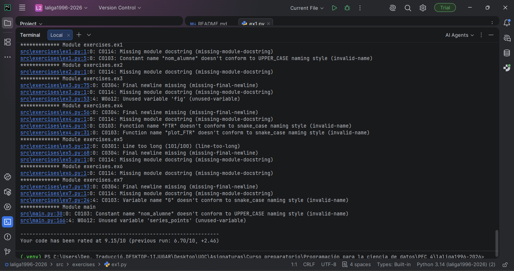
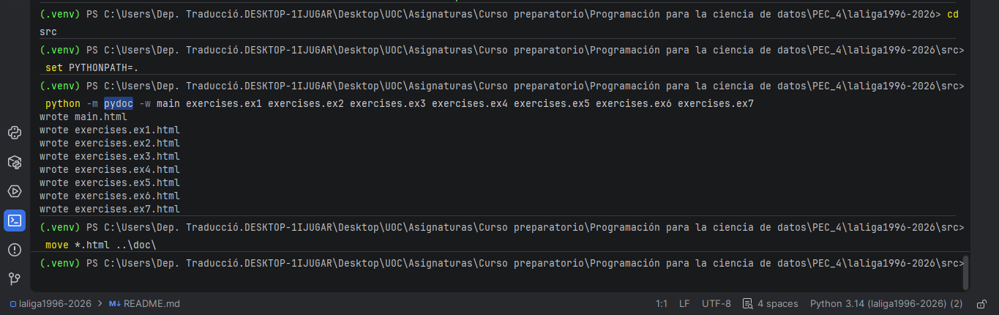
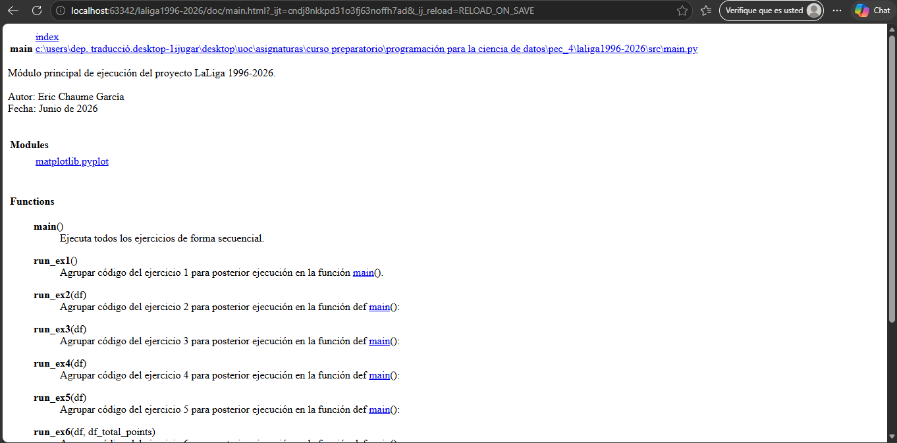
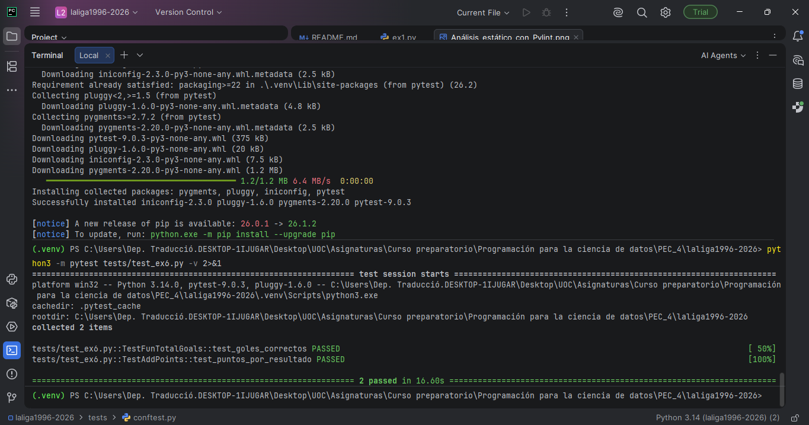

# LaLiga 1996-2026

Análisis estadístico de la LaLiga española desde la temporada 1996-97 hasta 2025-26.

**Autor:** Eric Chaume García

## Estructura del proyecto

```
laliga1996-2026/
├── src/
│   ├── main.py               # Punto de entrada principal
│   ├── exercises/            # Módulos por ejercicio
│   │   ├── ex1.py ... ex7.py
│   └── data/
│       └── LaLiga_Matches.csv
├── doc/                      # Documentación generada con pydoc
├── tests/                    # Tests unitarios
├── screenshots/              # Capturas de pantalla
├── requirements.txt
└── README.md
```

## Instalación

Las dependencias del proyecto están listadas en `requirements.txt`:

```
pandas
matplotlib
numpy
networkx
```

Instalarlas con:

```bash
pip install -r requirements.txt
```

## Licencia

Este proyecto se distribuye bajo la licencia **MIT**. Consulta el fichero [LICENSE](LICENSE) para más detalles.

## Subir el proyecto a GitHub

```bash
# 1. Inicializar el repositorio (solo la primera vez)
git init
git remote add origin https://github.com/echaugar/laliga1996-2026.git

# 2. Añadir los ficheros y hacer el primer commit
git add .
git commit -m "Initial commit"

# 3. Subir al repositorio remoto
git push -u origin main
```

Para actualizaciones posteriores:

```bash
git add .
git commit -m "Descripción del cambio"
git push
```

## Ejecución

```bash
python src/main.py
```

---

## Comprobación del análisis estático: Pylint

El código sigue la guía de estilo PEP8. Para comprobarlo se utiliza **pylint**.

### Cómo ejecutar el linting

Desde la raíz del proyecto:

```bash
pylint src/exercises/*.py src/main.py
```

Para generar un informe detallado:

```bash
pylint src/exercises/*.py src/main.py --output-format=text
```

### Configuración `.pylintrc`

Se ha creado un fichero `.pylintrc` para adaptar las reglas a los casos en que seguir estrictamente PEP8 reduciría la legibilidad:

- **`invalid-name`** desactivado puntualmente para nombres propios del dominio (`FTR`, `G`) que perderían significado si se reescribieran en snake_case.
- **`import-error`** desactivado para imports de librerías externas (`pandas`, `networkx`) que pueden no estar presentes en el entorno de análisis estático.

### Resultado

La comprobación obtiene una puntuación de **9.15/10**.



---

## Generación de la documentación: Pydoc

La documentación del proyecto se genera automáticamente a partir de los docstrings de cada módulo utilizando **pydoc**.

### Cómo generar la documentación

Desde la raíz del proyecto:

```bash
cd src && PYTHONPATH=. python3 -m pydoc -w main exercises.ex1 exercises.ex2 exercises.ex3 exercises.ex4 exercises.ex5 exercises.ex6 exercises.ex7 && mv *.html ../doc/
```

Los archivos HTML generados se guardan en la carpeta `doc/`:

| Archivo                    | Módulo                           |
| -------------------------- | --------------------------------- |
| `doc/main.html`          | Módulo principal                 |
| `doc/exercises.ex1.html` | EDA y visualización de goles     |
| `doc/exercises.ex2.html` | Total de partidos por equipo      |
| `doc/exercises.ex3.html` | Distribución de goles            |
| `doc/exercises.ex4.html` | Análisis de resultados (FTR)     |
| `doc/exercises.ex5.html` | Puntos totales por equipo         |
| `doc/exercises.ex6.html` | Goles por equipo y podium         |
| `doc/exercises.ex7.html` | Grafo de conexiones entre equipos |

Captura de la ejecución de Pydoc:



Captura de la página web "main.html"



---

## Comprobación de los tests

El proyecto incluye un test unitario para la función `fun_total_goals` del ejercicio 6, implementado con **pytest**.

### Cómo ejecutar los tests

Desde la raíz del proyecto:

```bash
pytest tests/ -v
```

Para ejecutar únicamente el test del ejercicio 6:

```bash
pytest tests/test_ex6.py -v
```

### Descripción de los tests

Los tests están implementados con `unittest.TestCase` y son compatibles con pytest.

| Test                                         | Función                    | Descripción                                                                   |
| -------------------------------------------- | --------------------------- | ------------------------------------------------------------------------------ |
| `TestFunTotalGoals::test_goles_correctos`  | `fun_total_goals` (ej. 6) | Verifica que los goles locales, visitantes y totales se calculan correctamente |
| `TestAddPoints::test_puntos_por_resultado` | `add_points` (ej. 5)      | Verifica que se asignan 3/0 pts en victoria, 1/1 en empate y 0/3 en derrota    |

Captura de la ejecución de los tests:


